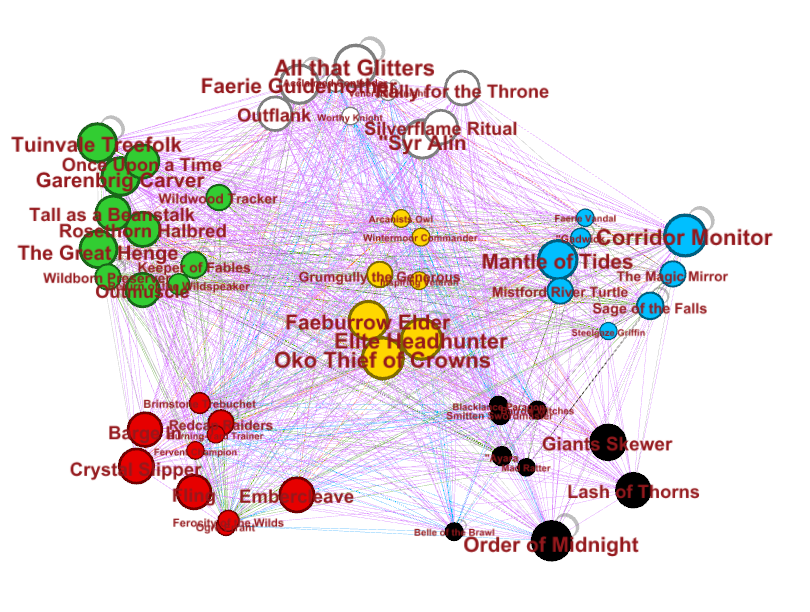
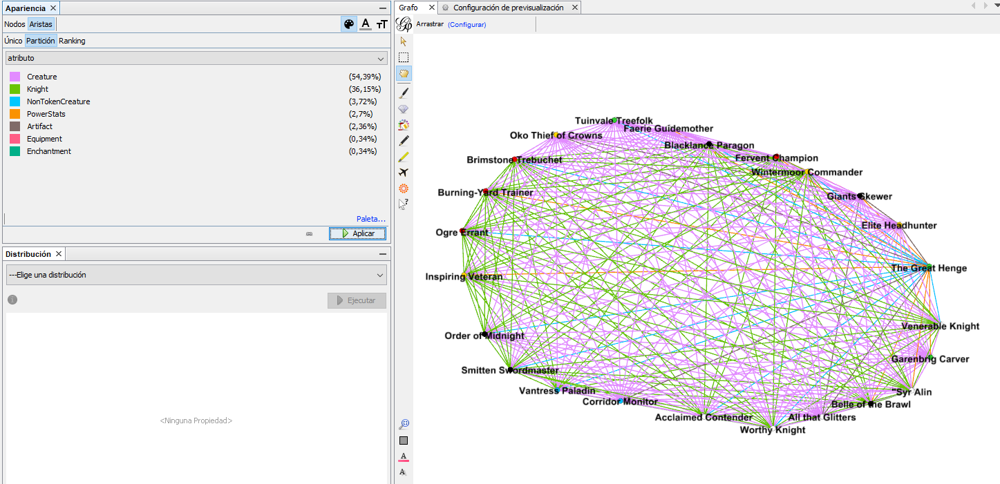

# MTGG
Magic the Gathering Graph of basic synergies. On the graph each card is a node and each edge is a basic synergy between them. The data has been manually collected in a csv, managed in Python with Networkx to make the graph and after that exported to gexf so it can be seen in Gephi, a program that lets you work with large graphs.

There are some reasons to do this. The degree of a node tells you how much that card synergizes with all the other cards. The edges could be weighted (based in some measurement of the value of the synergy, could be done by people or by easy rules) and this could be useful to understand why some synergies work in a certain set and others don't. Also, any clique in the graph is a subset of cards that are all connected between them, which can be seen as useful from a player's point of view. There are two images here about the graphs created with this:

The color pie of MtG with the most popular nodes in each part. The golden nodes are multicolored spells.

The max clique found by the script.

## How to run

You need to download Networkx (you can do that with pip) and Gephi (they have an [official website](https://gephi.org/) with info). The script and data.csv have to be in the same folder, it's just:

python dataToGraph.py

If you want to see the graphs as I visualized in the images, download Gephi and open the gexf files. The nodes are automatically colored, the edges are not (I don't know why that doesn't work) but I added a property so it can be colored by clicking on Partition of edges in Gephi and selecting 'atr'.

As this is just a silly project I started for fun, and because I wanted to have some fast feedback from it, there are some problems with the script and the data. Here I make a list of the main ones.

## Main problems
- Data has to be manually collected. While it only took me half hour to collect each color (around 35-40 cards), it's tedious and time-consuming. Because of this, only cards of Eldraine are right now collected. Maybe this could be solved by downloading the cards with their text and doing some script to obtain the "Generate" and "Benefits" list of each card. This seems hard.
- Another issue with the data being manually collected is that there are probably some errors and incoherences in some cards, even when I tried to follow strict rules.
- The most promising feature of this would be to extract useful synergies. This can't be done if the graph thinks all the synergies give the same value to the player. On the other hand, it's not clear how one can obtain a value of each synergy.
- I wasn't sure what to do with some effects. Return something to hand is an example of that, I just didn't know if it was worth to collect this kind of effects.
- At the start of collecting the data, I ignored almost all of keyword abilities like haste, menace or trample, because I thought there wasn't much (basic) interaction with other cards there. After that I thought this was a mistake, specially having in mind that it could be interesting to add the 'counters' graph. So some cards have their keyword, some don't. This needs to be fixed.

To do list:
- Adding code to manage properties with < or >, having in mind CMC, power and toughness (for example, Thunderous Snapper should have synergy with all spells of CMC>4)
- Right now the interactions between mechanics is hard coded in Python, this should be in another csv file
- Adding counters (interactions that work good against others), maybe another graph is needed
- Adding colorless cards of Eldraine
- Fixing keywords in creatures
- Making some procedure to give value to each synergy
- Adding the power and toughness of each creature
- Cleaning the code a bit
